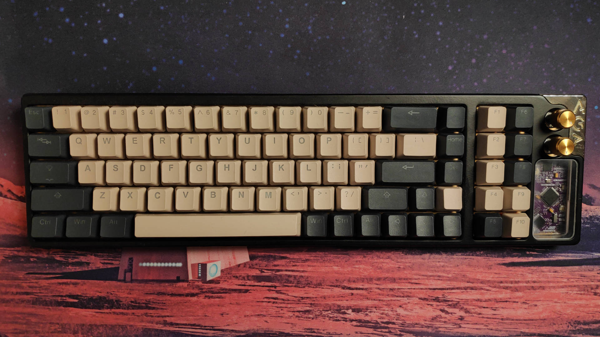
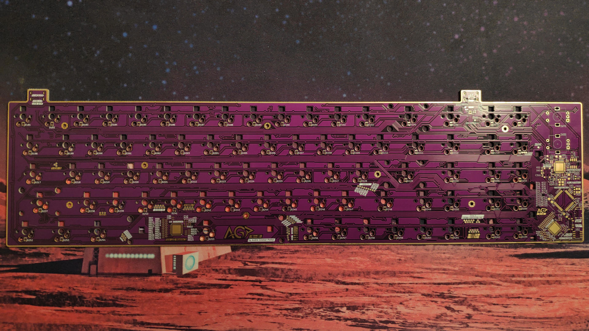
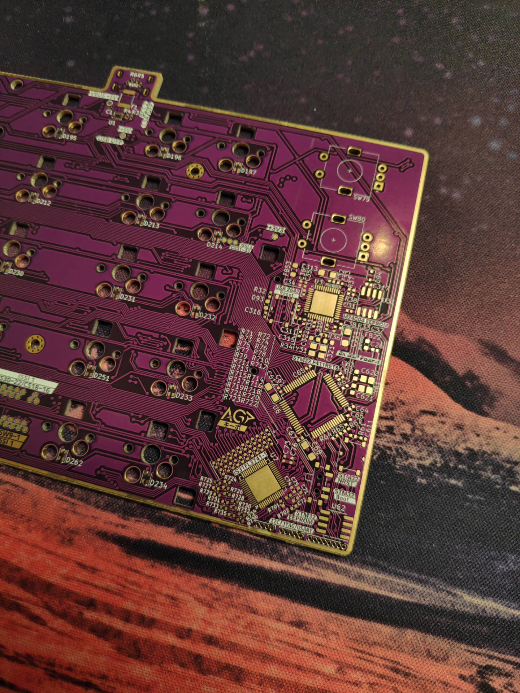
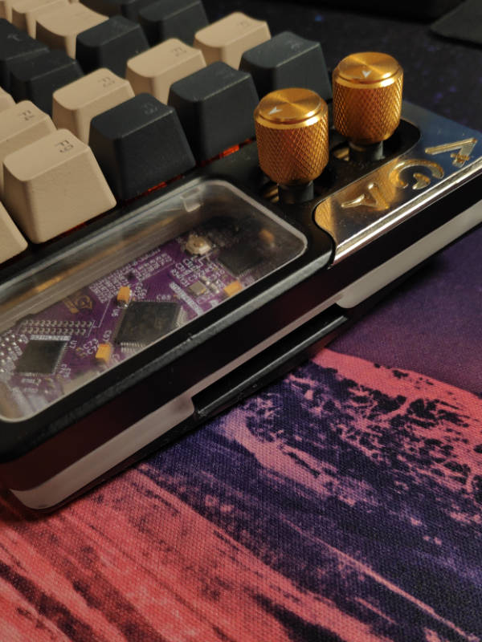
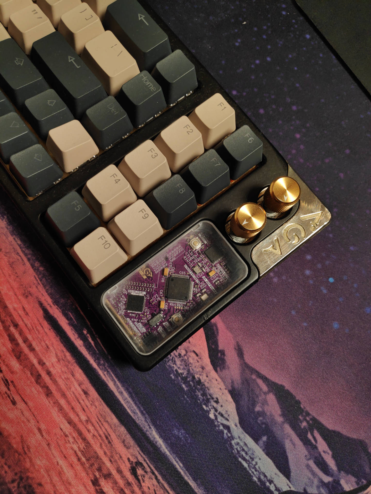
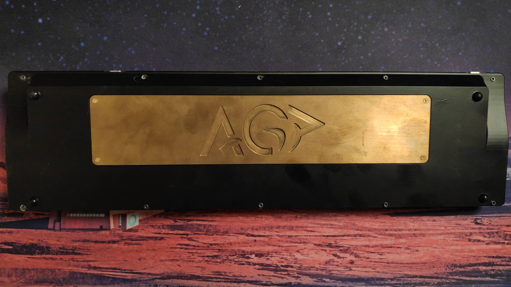

# AGPKeebo

The AGPKeebo is a 78 keys keyboard with a couple of unique features:

* General 65% layout with one extra key (language switch) on Row 5 (right-ALT and right-CTRL are U1)
* F1 - F10 keys in two separated columns
* 2x customizable knobs with push button function
* Each key contains two independent LEDs (1 north-facing and 1 south-facing LED)
* Additional independent LEDs for underglow
* 1x USB 2.0 Type C output for additional peripherals
* 1x SD Card reader

The main purpose of the two independent north- and south-facing LEDs was to allow highlighting certain keys for different language settings (e.g. highlight German "umlaute" such as ü or ö as side prints on the keys). However, this feature would require novel keycaps which do not exist yet. Making such keycaps are beyond the limitations of this project for now.

## Source Code

The [test](test) folder contains an STM32CubeIDE project to test the board and for training purposes. It will control all LEDs and keys so one can check if all connections work properly. The usb hub does not need further setup procedures and should work right out the box. 

### Technicalities

The board uses:

* STM32F411RET7 as the main MCU to control the keyboard logic
* USB2642 as the USB 2.0 HUB with integrated SD reader
* MAX14636CVB as USB Charge Detector to allow the board to draw up to 1.5A for all the LEDs
* 2x IS31FL3741 LED registers to control all LEDs
* 2x EEPROMS (one for USB hub and one for STM32F411) which are optional at this point

## PCB & Schematics

The PCB and the schematics were created using KiCad 6 and are available in the `pcb` folder. The `img` folder contains images for the key matrix layout.

### Case

Since the case is a non-standard layout, the `case` folder contains 3D step models to CNC or 3D print the case. The case design is a gasket mount style, of three layers + the plate sandwiched together. From top to bottom we have:
1. Top Layer
2. Plate
3. Middle acrylic layer for the underglow
4. Bottom Layer

Additionally, the case contains a weight (attached to the bottom layer), an artisan plate with magnet (R: 3mm, D: 1mm) holders, and an acrlic shield to cover the naked PCB for aesthetics. Besides step files it also contains a Fusion 360 archive file.

